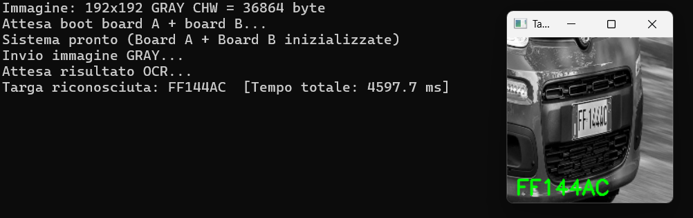

# ALPR on STM32: Distributed Detection and OCR

> A two-stage Automatic License Plate Recognition pipeline running entirely on
> two STM32 Nucleo-H745ZI-Q microcontrollers communicating over UART —
> no GPU, no NPU, no cloud inference.

<p align="center">
  
</p>

<p align="center">
  
  
  
  
  
  
  
</p>

**Demo video:** 🎬 _[Coming soon — link to be added](https://drive.google.com/REPLACE_WITH_YOUR_LINK)_

**Academic context:** project for the *Sistemi Operativi Dedicati* course,
Università Politecnica delle Marche, A.Y. 2025–2026.

---

## Table of Contents

- [Highlights](#highlights)
- [System Architecture](#system-architecture)
  - [End-to-end pipeline](#end-to-end-pipeline)
  - [Per-stage responsibilities](#per-stage-responsibilities)
  - [Memory layout and the `union` trick](#memory-layout-and-the-union-trick)
- [Hardware Setup](#hardware-setup)
- [Communication Protocol](#communication-protocol)
- [Neural Models](#neural-models)
- [Experimental Results](#experimental-results)
- [Repository Layout](#repository-layout)
- [Build & Flash](#build--flash)
- [Running the Host Script](#running-the-host-script)
- [Known Limitations](#known-limitations)
- [Future Work](#future-work)
- [Documentation](#documentation)
- [Authors](#authors)
- [References](#references)

---

## Highlights

- 🎯 **Two-stage pipeline split across two MCUs** — detection on Board A, OCR on
  Board B, joined by a custom UART framing protocol.
- 🧠 **Custom-trained YOLOv8-tiny** on single-channel 192×192 grayscale input
  (mAP@0.5 = 0.941 on the validation set).
- 🔡 **CCT-XS transformer for OCR**, deployed off the
  [`fast-plate-ocr`](https://github.com/ankandrew/fast-plate-ocr) project, no
  retraining required.
- 📉 **INT8 post-training quantization** through ST's X-CUBE-AI, with the
  RAM-optimized profile, fits both networks into 512 KB of SRAM.
- ⚙️ **Zephyr RTOS firmware** with interrupt-driven UART, ring buffers, and a
  static-allocation memory plan that gets Board A to **98 % RAM occupancy**
  without dynamic allocation.
- 🌍 **Multi-country recognition** — Italian, Swiss, and German plates work out
  of the box without retraining the OCR head.
- 🔬 **Deterministic latency**: ~4.6 s end-to-end with σ < 2 ms across runs.

---

## System Architecture

### End-to-end pipeline

The system is a three-node pipeline. The host PC is only an image source —
**all inference runs on the microcontrollers**.

```
┌────────────┐  USART3       ┌──────────────────┐  USART2       ┌──────────────────┐
│  PC host   │ ─────────────▶│  Board A (M7)    │ ─────────────▶│  Board B (M7)    │
│  Python    │  36 864 B     │  YOLOv8-tiny     │   8 192 B     │  CCT-XS OCR      │
│  test img  │   GRAY 192²   │  + NMS + crop    │   GRAY 128×64 │  + greedy decode │
│            │◀───────────── │                  │◀─────────────│                  │
└────────────┘   ≤ 9 chars   └──────────────────┘   ≤ 9 chars   └──────────────────┘
                  plate string                       plate string
```

<p align="center">
  
</p>

### Per-stage responsibilities

**Board A — Detection**

1. Receives the 192×192 grayscale image from the PC over USART3 (36 864 bytes).
2. Quantizes the buffer in-place to INT8 (zero-point = 128, scale = 1.0).
3. Runs inference on the custom **YOLOv8-tiny** through the X-CUBE-AI runtime.
4. Dequantizes the 756 anchors, applies Non-Maximum Suppression (conf
   threshold 0.5, IoU 0.5).
5. Restores the original pixels (`g = q + 128`), expands the bounding box by
   5 px on every side, and resizes the cropped region to **128×64** with
   nearest-neighbor interpolation.
6. Frames the crop as `TYPE_CROP` and forwards it to Board B over USART2.

**Board B — OCR**

1. Receives the 128×64 grayscale crop (8 192 bytes).
2. Expands the single grayscale channel into three RGB channels **in-place**,
   walking the buffer backwards to avoid overwrites.
3. Runs inference on the pretrained **CCT-XS** model.
4. Decodes the `[1, 9, 37]` output tensor with per-slot argmax, stopping at the
   first padding character (`_`).
5. Sends the resulting string back to Board A as `TYPE_TEXT`, which forwards it
   to the host PC.

A two-hop boot handshake (B → A → PC) ensures the host never sends an image
before both boards have finished initializing their neural runtime.

### Memory layout and the `union` trick

The single most important RAM optimisation: Board A reuses the same physical
36 864-byte buffer in **three successive states** through a C `union`:

```c
static union {
    uint8_t gray[GRAY_SIZE];                  /* received: pixels ∈ [0, 255]   */
    int8_t  net_in[STAI_NETWORK_IN_1_SIZE];   /* quantized: ∈ [−128, 127]      */
} io_buf __attribute__((aligned(4)));
```

| t | Active field    | Type     | Range          | Stage                              |
|---|-----------------|----------|----------------|------------------------------------|
| 1 | `io_buf.gray`   | `uint8`  | `[0, 255]`     | After UART reception               |
| 2 | `io_buf.net_in` | `int8`   | `[−128, 127]`  | Quantized input to the network     |
| 3 | `io_buf.gray`   | `uint8`  | `[0, 255]`     | Restored for crop construction     |

This single technique saves 36 864 bytes of RAM, which is the difference
between fitting Board A's firmware and not.

A similar in-place expansion is used on Board B: the 8 192-byte grayscale crop
is unrolled into a 24 576-byte RGB tensor by walking the buffer **backwards**,
copying each gray byte into three consecutive RGB slots without an auxiliary
buffer.

---

## Hardware Setup

| Component   | Description                                                                |
|-------------|----------------------------------------------------------------------------|
| Board A     | STM32 Nucleo-H745ZI-Q — Cortex-M7 @ 480 MHz, 512 KB SRAM, 1 MB Flash       |
| Board B     | STM32 Nucleo-H745ZI-Q — identical configuration                            |
| Host PC     | Any system with Python ≥ 3.9 and one USB port                              |

The dual-core M4 of the H745 is **not used** — both firmware images target the
Cortex-M7 only.

**UART wiring** (USART2, both boards, 115 200 baud, 8N1, no flow control):

| Function | MCU pin | Wire                              |
|----------|---------|-----------------------------------|
| TX       | `PD5`   | Board A `PD5` → Board B `PD6`     |
| RX       | `PD6`   | Board B `PD5` → Board A `PD6`     |
| GND      | `GND`   | **Common ground (mandatory)**     |

> ⚠️  A shared GND is **required**, not optional. UART is single-ended and
> without a common voltage reference the receiver cannot interpret the
> transmitter's logic levels.

The PC connects to Board A via the on-board ST-Link, which exposes a virtual
serial port mapped to USART3.

<p align="center">
  
  &nbsp;
  
</p>

---

## Communication Protocol

Every UART exchange is wrapped in a fixed 7-byte header followed by a
variable-length payload:

```
┌──────────┬──────────┬────────┬─────────────────────┬───────────────┐
│ MAGIC_0  │ MAGIC_1  │  TYPE  │  LENGTH (4 B BE)    │  PAYLOAD ...  │
│  0xAA    │  0xBB    │  (1 B) │   (big-endian)      │   (N bytes)   │
└──────────┴──────────┴────────┴─────────────────────┴───────────────┘
```

Defined message types:

| Code   | Name         | Direction         | Purpose                                |
|--------|--------------|-------------------|----------------------------------------|
| `0x01` | `TYPE_GRAY`  | PC → A            | Grayscale image to analyze             |
| `0x02` | `TYPE_BBOX`  | A → PC            | Bounding box (reserved, unused)        |
| `0x03` | `TYPE_ACK`   | A → PC, B → A     | System ready (boot handshake)          |
| `0x04` | `TYPE_ERR`   | any               | Error notification (code in payload)   |
| `0x05` | `TYPE_NONE`  | A → PC            | No plate detected                      |
| `0x06` | `TYPE_CROP`  | A → B             | Plate crop for OCR                     |
| `0x07` | `TYPE_TEXT`  | B → A → PC        | Recognized plate string                |

Receivers maintain a small ring buffer fed by the UART RX ISR and a blocking
parser on the main thread that resynchronizes on the magic prefix at every
frame boundary. The ring buffers are sized at the worst-case payload of each
channel (8 192 B for PC→A, 256 B for A→B replies, 8 199 B for B's RX).

---

## Neural Models

### Detection — YOLOv8-tiny (custom)

A scaled-down variant of YOLOv8 with a custom `t` scale:

- **Channels in**: 1 (grayscale)
- **Width multiplier**: 0.125 (half of YOLOv8n)
- **Depth multiplier**: 0.33
- **Classes**: 1 (`license_plate`)
- **Input**: 192 × 192 × 1 INT8
- **Output**: `[1, 4, 756]` boxes + `[1, 1, 756]` confidences (Concat node
  removed during ONNX export so the two tensors can be quantized with
  independent scales)

Training: Google Colab + Ultralytics, 50 epochs (early stopping patience = 15),
batch 64, lr0 = 0.01, no pretrained weights (channel count differs from the
RGB-pretrained checkpoints).

**Validation metrics:**

| Metric         | Value  |
|----------------|--------|
| mAP@0.5        | 0.941  |
| mAP@0.5:0.95   | 0.638  |
| Precision      | 0.979  |
| Recall         | 0.908  |
| F1 score       | 0.942  |

### OCR — Compact Convolutional Transformer XS

Pretrained `cct_xs_v1_global` from the
[fast-plate-ocr](https://github.com/ankandrew/fast-plate-ocr) project, based on
the architecture in *"Escaping the Big Data Paradigm with Compact
Transformers"* (Hassani et al., 2021, [arXiv:2104.05704](https://arxiv.org/abs/2104.05704)).

- **Input**: 128 × 64 × 3 (grayscale replicated on all three channels)
- **Output**: `[1, 9, 37]` logits (9 character slots × 37-class alphabet
  `0–9 A–Z _`)
- **Decoding**: greedy argmax per slot, stops at the first `_` (padding)
- **No retraining** — the model is used as published, only INT8-quantized via
  X-CUBE-AI

### X-CUBE-AI footprint (RAM-optimized profile)

| Quantity                | YOLOv8-tiny | CCT-XS      |
|-------------------------|-------------|-------------|
| MACC per inference      | 80.3 M      | 283.6 M     |
| Weights (Flash)         | ~602 KiB    | ~483 KiB    |
| Activation buffer (RAM) | ~272 KiB    | ~289 KiB    |
| Runtime library (RAM)   | ~38 KiB     | ~55 KiB     |

---

## Experimental Results

### Recognized plates

The system was validated on 26 real images spanning Italian, Swiss, and German
plates. The OCR head generalises across plate formats without per-country
retraining.

<p align="center">
  
  
</p>
<p align="center">
  
  
</p>

### Timing breakdown

End-to-end latency is **markedly deterministic**: σ < 2 ms across runs.

| Plate     | End-to-end (ms) |
|-----------|-----------------|
| FF144AC   | 4 597.7         |
| FR477XE   | 4 593.7         |
| TI 49959  | 4 594.6         |
| MG 5387   | 4 594.7         |
| **Mean**  | **4 595.17**    |
| **Std.**  | **1.74**        |

The bottleneck is **not** inference — it is UART transmission:

```
PC → Board A : 36 864 B / 11 520 B·s⁻¹  ≈ 3.20 s
Board A → B  :  8 192 B / 11 520 B·s⁻¹  ≈ 0.71 s
                                        ──────
                          UART transfers ≈ 3.91 s  (≈ 85 % of total)

Inference + post-processing                 ≈ 0.68 s  (< 15 % of total)
```

When no plate is detected the pipeline returns `TYPE_NONE` in ~3 484 ms — about
1 100 ms shorter than the success path, which is exactly the time saved by
**not** transferring the crop, **not** running the CCT inference, and **not**
sending the result back.

### Memory occupancy (Zephyr linker report)

| Board         | Flash used   | %     | RAM used    | %         |
|---------------|--------------|-------|-------------|-----------|
| A (detection) | 907.16 KB    | 88.6 %| 502.00 KB   | **98.1 %** |
| B (OCR)       | 812.23 KB    | 79.3 %| 384.63 KB   | 75.1 %    |

Board A sits at the absolute limit — about 10 KB of RAM headroom is what's
left for the entire system. The `union` trick was not a nice-to-have, it was
the difference between fitting and not fitting.

<p align="center">
  
</p>

### Observed OCR errors

Two recurring patterns, both attributable to the OCR rather than the detector:

- **Visually similar character confusion**: `G`↔`C`, `N`↔`M`, `0`↔`O`.
- **Slot duplication**: tilted plates can cause a single character to activate
  two adjacent decoding slots (e.g. `GX597NY` → `GGX597MY`).

These are inherent limitations of a 128×64 OCR resolution and are accentuated
by the upscaling of small crops.

---

## Repository Layout

```
SistemiOperativiDedicati/
├── README.md
├── docs/
│   ├── Relazione_SOD.pdf                  ← full project report (Italian)
│   └── images/                            ← figures used in this README
├── YOLO training notebook/
│   └── Training_YOLO_network.ipynb        ← Colab training + ONNX export
├── models/
│   ├── yolov8t_lp_gray_best.pt            ← YOLO PyTorch weights (FP32)
│   ├── yolov8t_lp_gray_split.onnx         ← ONNX with split outputs
│   └── cct_xs_v1_global.onnx              ← pretrained OCR model
├── python/
│   ├── plate_recognition.py               ← host-side test driver
│   └── plate_dataset/                     ← 26 test images
└── zephyr/
    ├── board_A_project/                   ← detection firmware
    │   ├── CMakeLists.txt
    │   ├── prj.conf                       ← Zephyr config (UART, FPU, SRAM)
    │   ├── boards/                        ← H745 devicetree overlays
    │   ├── cube_ai/                       ← X-CUBE-AI generated runtime
    │   └── src/main.c
    └── board_B_project/                   ← OCR firmware (same structure)
```

---

## Build & Flash

### Prerequisites

- Zephyr installed via the
  [official getting-started guide](https://docs.zephyrproject.org/latest/develop/getting_started/index.html)
- Zephyr SDK with the `arm-zephyr-eabi` toolchain
- `west` configured and on `PATH`
- ST-Link drivers and `OpenOCD` (or STM32CubeProgrammer) for flashing

### Build each board

From inside the project directory (`zephyr/board_A_project` or
`zephyr/board_B_project`):

```bash
west build -b nucleo_h745zi_q/stm32h745xx/m7 --pristine
west flash
```

### Build notes

- Both firmware images run on the **Cortex-M7 core**; the M4 is not used.
- `-mfpu=fpv5-d16 -mfloat-abi=hard` is forced in `CMakeLists.txt` to guarantee
  ABI compatibility with the precompiled X-CUBE-AI library
  (`NetworkRuntime1200_CM7_GCC.a`).
- The main SRAM is mapped to `0x24000000` with size `0x80000` (512 KB) via
  devicetree overlay — without this Zephyr would default to a smaller bank
  that cannot hold the activation buffers.

---

## Running the Host Script

After flashing both boards and wiring them up:

```bash
python -m venv .venv
source .venv/bin/activate            # Windows: .venv\Scripts\activate
pip install opencv-python numpy pyserial
```

Edit `python/plate_recognition.py` and set:

- `PORT` — the serial port exposed by Board A's ST-Link (e.g. `COM3` on
  Windows, `/dev/ttyACM0` on Linux).
- `IMG_PATH` — the test image to send.

Run it:

```bash
python python/plate_recognition.py
```

Expected output:

```
Immagine: 192x192 GRAY CHW = 36864 byte
Attesa boot board A + board B...
Sistema pronto (Board A + Board B inizializzate)
Invio immagine GRAY...
Attesa risultato OCR...
Targa riconosciuta: FR477XE  [Tempo totale: 4593.7 ms]
```

The script also opens a window with the recognized string overlaid on the
input image.

---

## Known Limitations

- **High latency (~4.6 s)** — dominated by UART transfers, not inference.
  Switching the inter-board link to SPI at 8 Mbps would bring the crop transfer
  from ~710 ms to under 10 ms.
- **CPU-only inference** — the H745 lacks a neural accelerator, so both
  networks run entirely on the Cortex-M7. An STM32N6 with Neural-ART would cut
  inference time by roughly two orders of magnitude.
- **Character confusion** — the pretrained OCR confuses visually similar
  characters at 128×64 resolution and may duplicate slots on tilted plates.
  Fine-tuning on Italian plates would mitigate this.
- **No camera input** — images are sent from a host PC. The DCMI interface of
  the H745 could feed frames directly via DMA, but is not wired up in this
  project.
- **No multi-plate scenes** — the firmware keeps only the highest-confidence
  detection. Extending it to forward every above-threshold crop would be
  straightforward but is not implemented.

---

## Future Work

- 🚀 **SPI inter-board link at 8 Mbps** — eliminates ~700 ms of latency.
- 📷 **Direct camera capture via DCMI + DMA** — removes the PC dependency and
  makes the system standalone.
- 🧠 **STM32N6 with Neural-ART NPU** — could collapse both stages onto a single
  board and bring end-to-end latency well under one second.
- 🎓 **OCR fine-tuning** on a country-specific dataset to address
  `G`/`C`, `N`/`M`, `0`/`O` confusion.
- 🧵 **Cortex-M4 offload** — the dormant M4 core could handle UART and
  framing, letting the M7 overlap reception and inference.

---

## Documentation

The full project report (in Italian) is available at
[`docs/Relazione_SOD.pdf`](docs/Relazione_SOD.pdf).
It covers the theoretical background (CNN detection, Vision Transformers,
INT8 quantization), the training pipeline, the firmware architecture, the
communication protocol, and a deeper experimental analysis.

A 🎬 **demo video** showcasing the system running end-to-end is available at:
**[Google Drive link — to be added]**(https://drive.google.com/REPLACE_WITH_YOUR_LINK)

---

## Authors

**Gruppo Oasis** — Università Politecnica delle Marche, A.Y. 2025–2026
*Ingegneria Informatica e dell'Automazione*

- Anass Chebbaki
- Andrea Pizzuto
- Matteo Stronati
- Matteo Talè
- Roberto Dimitri

**Supervisor:** Prof. Aldo Franco Dragoni

---

## References

1. A. Hassani et al., *"Escaping the Big Data Paradigm with Compact
   Transformers"*, arXiv:2104.05704, 2021.
2. G. Jocher, A. Chaurasia, J. Qiu — *Ultralytics YOLOv8*,
   [github.com/ultralytics/ultralytics](https://github.com/ultralytics/ultralytics).
3. ankandrew — *fast-plate-ocr: lightweight license plate OCR*,
   [github.com/ankandrew/fast-plate-ocr](https://github.com/ankandrew/fast-plate-ocr).
4. STMicroelectronics — *X-CUBE-AI: artificial intelligence (AI) software
   expansion for STM32Cube*,
   [st.com/.../x-cube-ai.html](https://www.st.com/en/embedded-software/x-cube-ai.html).
5. Zephyr Project — *Documentation*,
   [docs.zephyrproject.org](https://docs.zephyrproject.org).
6. Roboflow — *Universe: open-source computer-vision datasets*,
   [universe.roboflow.com](https://universe.roboflow.com).
7. B. Jacob et al., *"Quantization and Training of Neural Networks for
   Efficient Integer-Arithmetic-Only Inference"*, CVPR 2018.